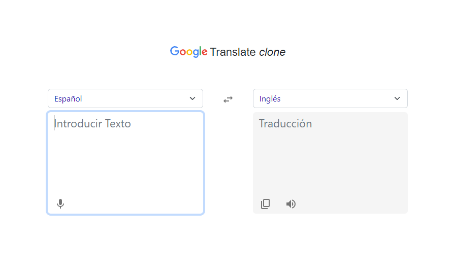

# Google-Translate-Clone
Una réplica del traductor de Google, desarrollado utilizando las tecnologías TypeScript y React. 
Para la traducción de los textos, se utilizó una API gratuita llamada https://api.mymemory.translated.net/. 
Esta aplicación web permite a los usuarios ingresar un texto en un idioma y recibir su 
traducción en otro idioma, brindando una experiencia de traducción *similar* a la que ofrece el popular servicio de Google. 
 
